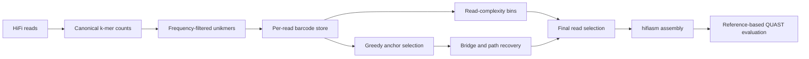

# MTPLite

MTPLite is a research workflow for targeted read selection before long-read
assembly. It represents PacBio HiFi reads as ordered lists of frequency-filtered
single-copy k-mers ("unikmers"), selects a compact set of informative reads,
and assembles that set with hifiasm.

The checked-in v1.1 study focuses on *Caenorhabditis elegans* chromosome I.
This repository is a **mirror of the research implementation**; the original
codebase is the source of truth. It is not yet a packaged command-line tool.

## Research summary

The v1.1 reference experiment began with 1.31 million HiFi reads at roughly
1,000× coverage. MTPLite selected 14,176 reads (about 1.08% of the input) for
assembly. QUAST evaluated the resulting three-contig assembly against the
*C. elegans* chromosome I reference (NC_003279.8), reporting 99.993% genome
fraction and no reported misassemblies. These are results from one recorded
configuration and dataset, not performance guarantees for other organisms,
regions, sequencing runs, or parameter choices.

| Measure | Recorded v1.1 value |
| --- | ---: |
| Input reads | 1.31 million (~1,000×) |
| Unikmers retained | 13,468,121 |
| Anchor reads | 1,540 |
| Final selected reads | 14,176 (≈1.08%) |
| Assembly contigs | 3 |
| Assembly N50 | 12,142,537 bp |
| Genome fraction | 99.993% |
| Misassemblies / local misassemblies | 0 / 0 |

The complete reference-based evaluation is available in
[report.pdf](report.pdf). See [Results and interpretation](<docs/MTPLite v1.1.md#reference-experiment-results>)
for appropriate context and limitations.

## Method at a glance



1. **Identify unikmers.** Jellyfish counts canonical nucleotide k-mers. A
   frequency window derived from the observed histogram identifies candidate
   single-copy k-mers.
2. **Barcode reads.** Each read becomes an ordered sequence of unikmer IDs in
   a memory-mapped binary store.
3. **Select anchors.** Lazy greedy set cover chooses reads that collectively
   cover the observed unikmer universe.
4. **Recover connectivity.** Direct-overlap detection and bounded
   anchor-to-anchor path searches add likely connecting reads.
5. **Assemble and evaluate.** The selected read set is assembled with hifiasm
   and evaluated against a target reference with QUAST.

The full methods description, implementation choices, and recorded parameters
are in [the v1.1 technical notes](<docs/MTPLite v1.1.md>).

## Quick start

This workflow requires manual configuration before it can run. The entry
points contain placeholder paths and values such as
`path/to/your/project_directory`; do not execute them unchanged.

```bash
conda env create -f environment.yml
conda activate mtplite-v1.1
```

Then follow the documentation in order:

1. [Prepare the environment and configure every entry point](docs/SETUP.md).
2. [Record inputs, parameters, and software provenance](docs/REPRODUCIBILITY.md).
3. [Run the dependency-ordered workflow](docs/HOW_TO_RUN.md).
4. [Interpret the reference result and methods](<docs/MTPLite v1.1.md>).

### Path configuration contract

Choose one project artifact root. Set `DIR` in `extractUnikmers.sh`, the
`base_dir` values in the Python stages, and `DEFAULT_BASE_DIR` in
`barcode_assembler.py` to that same directory. The final-selection script must
use `<project-root>/output` as `output_dir`, because `anchor.py` writes
`anchors.pkl` there. It then writes the selected-read FASTA as
`<project-root>/output/<prefix>.fasta`.

Configure `assembly.sh` with that FASTA as `READ_FILE`, retain the same
`PREFIX`, and set `OUT_DIR` to the directory where hifiasm outputs should be
written. `THREADS` is configured independently in the two shell scripts.

Raw sequencing data, reference genomes, binary indices, and derived assembly
outputs are intentionally not included in the repository. The workflow's
resource demands are substantial: the recorded head index held approximately
71.2 million keys and 17.2 GB of packed read-ID data, in addition to temporary
memory used during construction.

## Repository contents

| Path | Description |
| --- | --- |
| [`mtp_lite_v1.1/`](mtp_lite_v1.1/) | Mirrored implementation and shell entry points. |
| [`docs/`](docs/) | Setup, execution, reproducibility, and technical-method documentation. |
| [`environment.yml`](environment.yml) | Conda environment matching the recorded v1.1 toolchain. |
| [`report.pdf`](report.pdf) | Saved QUAST report for the reference experiment. |
| [`CITATION.cff`](CITATION.cff) | Citation metadata for this software record. |
| [`CONTRIBUTING.md`](CONTRIBUTING.md) | Contribution and mirror-maintenance guidance. |

## Reproducibility and scope

MTPLite v1.1 is best treated as a documented computational experiment. A new
run is a new experiment: record its input and reference checksums, tool
versions, hardware, parameter values, commands, logs, and output checksums
before comparing it with the v1.1 result. The
[reproducibility guide](docs/REPRODUCIBILITY.md) provides a minimal record to
keep with each run.

The pipeline uses dataset-specific constants and manual path configuration.
Adapting it to a different target requires methodological validation, especially
for the k-mer frequency window, expected coverage and genome size, bridge
threshold, and index/path-search limits.

## Citation

If MTPLite contributes to published work, cite the software record described
in [CITATION.cff](CITATION.cff) and report the exact commit, environment,
parameters, input provenance, and reference assembly used. No archival DOI or
peer-reviewed manuscript is associated with this mirror at present.

## Contributing and license

Please read [CONTRIBUTING.md](CONTRIBUTING.md) before opening a change. In
particular, implementation changes here must be propagated to the original
repository to become canonical.

MTPLite is released under the [MIT License](LICENSE).
