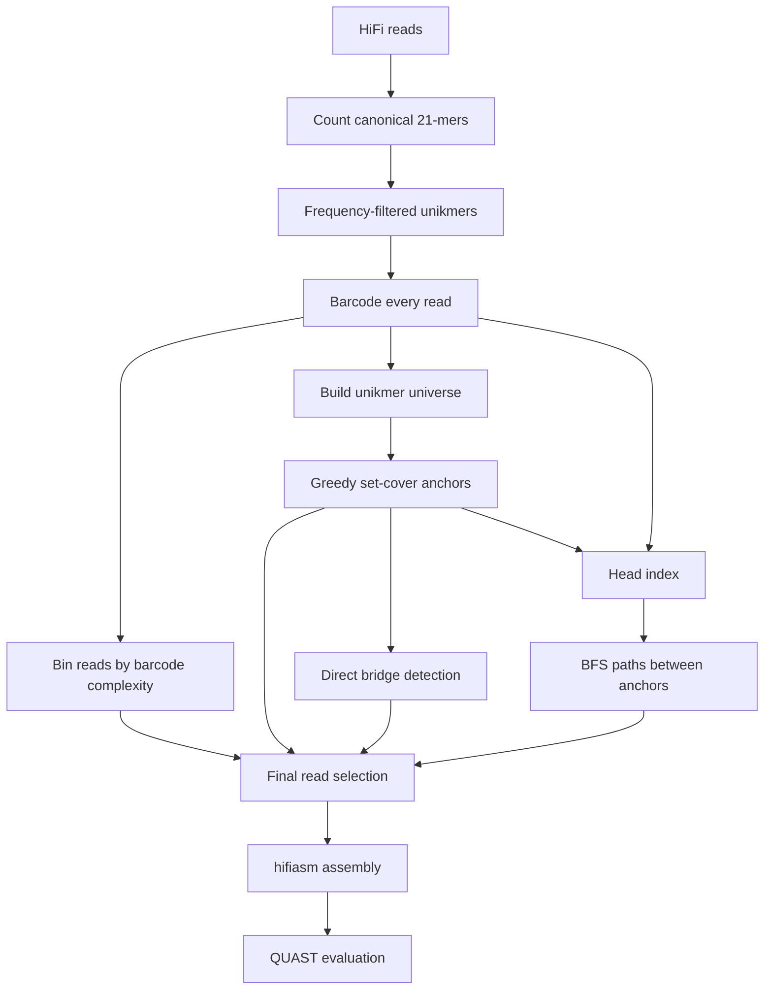

# MTPLite v1.1

MTPLite is a targeted metagenomic read-selection pipeline for assembling a
specific genomic region from deep PacBio HiFi sequencing data.  Rather than
assemble every input read, it identifies a compact, information-rich subset
using single-copy k-mers ("unikmers") and then assembles that subset with
hifiasm.

The v1.1 experiment targets *Caenorhabditis elegans* chromosome I.  Starting
with 1.31 million reads at approximately 1,000× coverage, MTPLite selected
14,176 reads (about 1.08% of the input) and produced a three-contig assembly
covering 99.993% of the reference with no reported misassemblies.  The
reference-based QUAST evidence is included in [report.pdf](report.pdf).

> This repository is a research workflow, not yet a parameterized command-line
> application.  Its scripts contain dataset-specific paths and settings; read
> [Configuration](#configuration) before running it on another system or
> dataset.

## Documentation

For a reproducible installation and run, start with the
[documentation index](docs/README.md), then follow the
[setup guide](docs/SETUP.md) and [how-to-run guide](docs/HOW_TO_RUN.md).
The [technical design notes](<docs/MTPLite v1.1.md>) explain the algorithms,
and [report.pdf](report.pdf) contains the reference-based QUAST results.

## How it works

MTPLite represents each read as an ordered list of unikmer identifiers—a
barcode.  Two overlapping reads share an ordered run of barcode IDs, which
lets later stages perform coverage and overlap operations over compact integer
arrays instead of raw nucleotide sequences.



1. **Identify unikmers.** Jellyfish counts canonical nucleotide k-mers.  The
   histogram is used to select the expected single-copy frequency window
   (mean ± 3 standard deviations, with the lower bound clamped to 5) for
   `k=21`.
2. **Create a barcode store.** Each selected 21-mer is encoded canonically in
   two bits.  A rolling forward/reverse-complement scan converts every read
   into an ordered `uint32` barcode list, written to memory-mappable `.idx`
   and `.data` files.
3. **Cover the unikmer universe.** A lazy greedy set-cover algorithm chooses
   anchor reads that collectively cover all observed unikmers.  It uses a
   dense NumPy coverage vector and a max-heap so scores are only recalculated
   when needed.
4. **Recover connecting reads.** Direct bridging finds reads whose barcode
   prefix and suffix match anchor ends using two rolling hashes.  Separately,
   an inverted index of 11-barcode-ID tuples supports bounded breadth-first
   searches between anchors.
5. **Select and assemble.** The final set combines anchors, direct bridges,
   reads on anchor-to-anchor paths, and reads from low-barcode-complexity bins.
   hifiasm assembles the selected reads; QUAST compares the primary contigs to
   the target reference.

## Repository layout

| Path | Purpose |
| --- | --- |
| [`mtp_lite_v1.1/`](mtp_lite_v1.1/) | Pipeline scripts and the memory-mapped barcode-store implementation. |
| [`mtp_lite_v1.1/extractUnikmers.sh`](mtp_lite_v1.1/extractUnikmers.sh) | Counts k-mers, builds a histogram, and writes the unikmer list. |
| [`mtp_lite_v1.1/read_unikmer_map.py`](mtp_lite_v1.1/read_unikmer_map.py) | Creates read-ID maps, barcode files, and read statistics. |
| [`mtp_lite_v1.1/anchor.py`](mtp_lite_v1.1/anchor.py) | Performs lazy greedy anchor selection. |
| [`mtp_lite_v1.1/direct_bridge.py`](mtp_lite_v1.1/direct_bridge.py) | Detects high-confidence direct bridge reads. |
| [`mtp_lite_v1.1/indexer.py`](mtp_lite_v1.1/indexer.py) | Builds the sorted barcode head index. |
| [`mtp_lite_v1.1/barcode_assembler.py`](mtp_lite_v1.1/barcode_assembler.py) | Searches for paths between anchors. |
| [`mtp_lite_v1.1/final_read_selection.py`](mtp_lite_v1.1/final_read_selection.py) | Merges selected read IDs and writes a FASTA. |
| [`mtp_lite_v1.1/assembly.sh`](mtp_lite_v1.1/assembly.sh) | Runs hifiasm and extracts primary contigs from its GFA. |
| [`docs/MTPLite v1.1.md`](<docs/MTPLite v1.1.md>) | Detailed design notes, algorithm explanations, and experiment context. |
| [`docs/run_order.md`](docs/run_order.md) | Original execution order. |
| [`docs/SETUP.md`](docs/SETUP.md) | Requirements, environment installation, data preparation, and path configuration. |
| [`docs/HOW_TO_RUN.md`](docs/HOW_TO_RUN.md) | Dependency-ordered commands, checkpoints, evaluation, and troubleshooting. |
| [`environment.yml`](environment.yml) | Conda environment matching the recorded v1.1 toolchain. |
| [`report.pdf`](report.pdf) | QUAST report for the v1.1 assembly. |

## Requirements

The recorded experiment used the following environment:

| Component | Recorded version | Role |
| --- | ---: | --- |
| Python | 3.8.20 | Runs the pipeline scripts. |
| Jellyfish | 2.2.10 | Canonical k-mer counting, histogram generation, and extraction. |
| hifiasm | 0.25.0 | HiFi assembly. |
| QUAST | 5.3.0 | Reference-based assembly evaluation. |
| NumPy | 1.24.3 | Vectorized coverage calculations. |
| Biopython | 1.78 | FASTA/FASTQ parsing and FASTA output. |
| XlsxWriter | 3.1.1 | K-mer histogram workbook output. |

The scripts also require Bash and standard Unix tools (`awk`, `sed`, `cut`,
and `xargs`). QUAST invokes minimap2 internally for alignment; its standalone
version was not separately recorded.

An environment equivalent to the recorded one can be created with Conda, for
example:

```bash
conda create -n mtplite -c conda-forge -c bioconda \
  python=3.8.20 numpy=1.24.3 biopython=1.78 xlsxwriter=3.1.1 \
  jellyfish=2.2.10 hifiasm=0.25.0 quast=5.3.0
conda activate mtplite
```

## Configuration

### Current path assumptions

The Python entry points resolve the project directory as `~/MTPLite`. The two
shell scripts currently use the original absolute path
`/home/vselv001/MTPLite`. For the workflow to run unchanged, the repository
and dataset must therefore be located at those paths for the original user.

For another account, update the `base_dir` assignment in the Python entry
points and the `DIR`, `READ_FILE`, and `OUT_DIR` variables in the shell
scripts to the same project root. Run Python scripts from
`mtp_lite_v1.1/`, because they import local modules such as `barcode_store`.

### Expected inputs

The supplied configuration expects:

```text
MTPLite/
├── input/
│   └── hifi_1000x_chr1.fastq   # PacBio HiFi reads
└── reference/
    └── chr1.fasta              # target reference, used only by QUAST
```

`read_unikmer_map.py` recognizes uncompressed FASTQ or FASTA based on the
filename extension. `final_read_selection.py` additionally supports gzipped
FASTQ/FASTA input, although the configured input is an uncompressed FASTQ.

### Dataset-specific parameters in v1.1

| Setting | Value | Defined in |
| --- | ---: | --- |
| Nucleotide unikmer size | 21 | `extractUnikmers.sh`, `read_unikmer_map.py` |
| Jellyfish threads | 32 | `extractUnikmers.sh` |
| Read-binning coverage | 1,000× | `bin_reads.py` |
| Read-binning genome size | 14,550,000 bp | `bin_reads.py` |
| Direct-bridge minimum overlap | 100 barcode IDs | `direct_bridge.py` |
| Barcode index tuple length | 11 IDs | `indexer.py`, `barcode_assembler.py` |
| Non-anchor index stride | 3 | `indexer.py` |
| Indexed/query end window | 25%, capped at 4,000 IDs | `indexer.py`, `barcode_assembler.py` |
| BFS maximum depth | 15 reads | `barcode_assembler.py` |
| Paths retained per anchor | 10 | `barcode_assembler.py` |
| BFS expansion cap per anchor | 10,000,000 | `barcode_assembler.py` |
| hifiasm threads | 40 | `assembly.sh` |

When adapting the workflow, tune the k-mer-frequency window, expected genome
size, coverage, and the bridge/index thresholds for the organism, sequencing
depth, and available memory. The selected frequency window is calculated from
the input histogram rather than hard-coded.

## Running the pipeline

After configuring paths and placing the input reads in the expected location,
run the stages in order. The original command sequence is retained in
[`docs/run_order.md`](docs/run_order.md).

```bash
cd mtp_lite_v1.1

# 1. Count 21-mers and extract frequency-filtered unikmers.
bash extractUnikmers.sh prefix 21

# 2–9. Build barcode data, select reads, and prepare the assembly input.
python -u read_unikmer_map.py
python -u bin_reads.py
python -u universe.py
python -u anchor.py
python -u direct_bridge.py
python -u indexer.py
python -u barcode_assembler.py
python -u final_read_selection.py

# 10. Assemble the selected reads.
bash assembly.sh

# 11. Evaluate the primary-contig assembly against the target reference.
cd ..
quast.py output/mtpv1.1/mtpv1.1.asm.fasta \
  -r reference/chr1.fasta \
  -o output/quast_mtpv1.1
```

The original workflow used `nohup ... > stage.log 2>&1 &` for the long Python
stages. Run each stage only after its prerequisite has completed successfully;
the numbered order above is a dependency order, not a set of parallel jobs.

### Stage inputs and outputs

| Stage | Main input | Main output |
| --- | --- | --- |
| `extractUnikmers.sh` | `input/hifi_1000x_chr1.fastq` | `jellyfish_data/prefix.unikmers`, count, histogram, and workbook files |
| `read_unikmer_map.py` | unikmers and reads | `barcode_21mers/read_unikmer_map.{idx,data}`, `rid_maps/*.pkl`, `stats/read_stats.pkl` |
| `bin_reads.py` | read statistics | `bins/binned_reads.pkl`, `bins/binned_reads.csv`, `stats/unikmer_distribution.csv` |
| `universe.py` | barcode store and read-ID map | `universe/universe.pkl` |
| `anchor.py` | universe and barcode store | `output/anchors.pkl` |
| `direct_bridge.py` | anchors and barcode store | `bridges_v1.1/direct_bridges.pkl` |
| `indexer.py` | barcode store and anchors | `barcode_21mers/head_index/head_index.{idx,data}` |
| `barcode_assembler.py` | anchors, barcode store, head index | `bridges_v1.1/bridges.pkl` |
| `final_read_selection.py` | anchors, bridge files, bins, reads | `output/mtpv1.1.fasta` |
| `assembly.sh` | selected-read FASTA | `output/mtpv1.1/mtpv1.1.asm.fasta` |
| QUAST | assembly and reference | `output/quast_mtpv1.1/` |

## Storage and runtime considerations

The implementation is designed to avoid retaining every barcode list in
Python objects. The barcode store writes a 16-byte index entry per read:

```text
uint64 data offset | uint32 barcode count | uint32 read length
```

The barcode IDs themselves are packed as `uint32` values in a separate data
file and read through `mmap`. This makes random barcode access inexpensive,
but the workflow remains resource-intensive at deep coverage. In the recorded
run, the sorted 11-ID head index contained about 71.2 million unique keys and
approximately 17.2 GB of packed read-ID data. Building it also first
accumulates keys in memory, so provision substantial RAM and fast local
storage.

Two stages replace existing output directories:

- `indexer.py` removes and rebuilds `barcode_21mers/head_index/`.
- `final_read_selection.py` empties `output/mtpv1.1/` before assembly output
  is generated.

Preserve any output you need before re-running those stages.

## v1.1 experiment results

The following values are from the included QUAST report for
`mtpv1.1.asm`, evaluated against *C. elegans* chromosome I reference
NC_003279.8 (15,072,434 bp). They are evidence for this dataset and
configuration, not a guarantee of performance on another target.

| Metric | Result |
| --- | ---: |
| Input reads | 1.31 million (~1,000×) |
| Unikmers retained | 13,468,121 |
| Anchors selected | 1,540 (100% unikmer-universe coverage) |
| Direct bridge reads | 24 |
| Anchor-to-anchor BFS paths | 15,355 |
| Final selected reads | 14,176 (≈1.08% of input) |
| Assembly contigs | 3 |
| Largest contig / N50 | 12,142,537 bp |
| Assembly length | 15,079,659 bp |
| Genome fraction | 99.993% |
| Misassemblies / local misassemblies | 0 / 0 |
| Mismatches / indels per 100 kbp | 0.14 / 1.36 |
| Duplication ratio | 1.001 |
| N bases per 100 kbp | 0.00 |

See [report.pdf](report.pdf) for the full QUAST tables and plots. The report
also records 21 mismatches and 205 indels across the aligned assembly.

## Notes on v1.1

Compared with the previous configuration described in the design notes, v1.1
uses a deeper/wider path search (depth 15, 10 paths per anchor, 10 million
expansions), an 11-ID index key over a 25% end window, and a stricter
100-barcode direct-bridge threshold. The documented outcome was a larger
selected set (14,176 versus 9,998 reads), fewer contigs (3 versus 5), and a
larger N50 (12.1 Mbp versus 8.0 Mbp).

For algorithmic detail and design rationale, see
[the v1.1 technical notes](<docs/MTPLite v1.1.md>).

## License

This project is available under the [MIT License](LICENSE).
